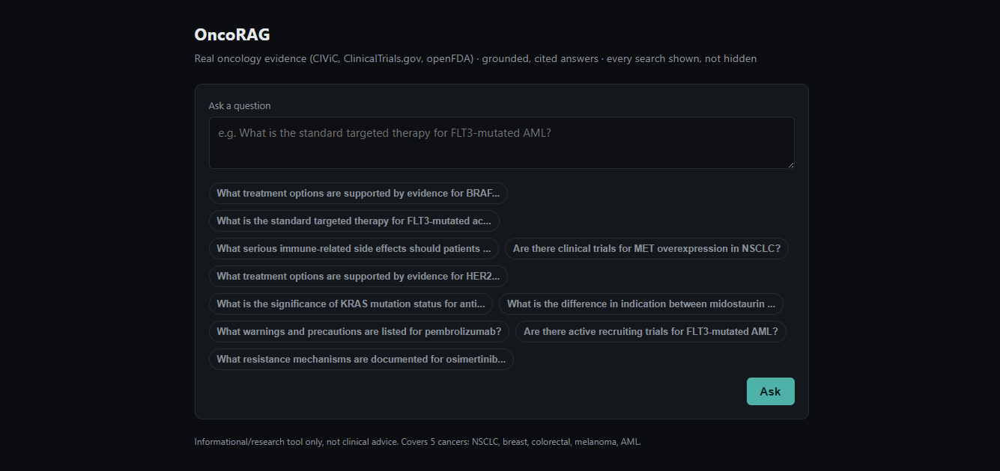

# OncoRAG

Production-grade RAG + agentic oncology knowledge system, built on Weaviate.



Real oncology data (CIViC, ClinicalTrials.gov, openFDA) in a Weaviate hybrid
search index, tuned empirically against a golden eval set, behind a
transparent, citation-backed LLM agent (Claude Sonnet 5) — every answer
comes with the full search trace and the actual sources behind it, not a
black-box response. Covers five cancers: NSCLC, breast, colorectal,
melanoma, and AML.

Built in phases, each with its own spec/eval and a PR: see `docs/` for the
full history (gitignored — internal planning notes, not published).

## Why this exists

Most "RAG chatbot" projects stop at "it retrieves something and an LLM
summarizes it." This one is built the way a production system would be:
retrieval tuned against a real eval set (not defaults), every agent
decision measured before being kept or discarded, every answer traceable
back to the exact search that produced it, and adversarially tested
against jailbreak/misuse attempts before being called done. See
[Evaluation](#evaluation) below for the actual numbers, not just claims.

## Try it

Ask about any of the five covered cancers — targeted therapies, resistance
mechanisms, drug safety warnings, or clinical trials. A few to start with:

- What is the standard targeted therapy for FLT3-mutated acute myeloid leukemia?
- What treatment options are supported by evidence for BRAF V600E mutated melanoma?
- What is the significance of KRAS mutation status for anti-EGFR therapy in colorectal cancer?
- What treatment options are supported by evidence for HER2-positive breast cancer?
- Are there clinical trials for MET overexpression in NSCLC?
- What serious immune-related side effects should patients on pembrolizumab watch for?
- What is the difference in indication between midostaurin and gilteritinib?
- What warnings and precautions are listed for pembrolizumab?
- What resistance mechanisms are documented for osimertinib in EGFR-mutated NSCLC?
- Compare the evidence base for midostaurin versus gilteritinib in FLT3-mutated AML.

Every answer expands into the full reasoning trace (each search run, with
result counts) and the actual source citations behind the claims — nothing
is hidden. The live demo rate-limits anonymous visitors to 20 questions/day
per IP to keep API costs bounded; running it yourself (below) removes that
limit entirely.

This is an informational/research tool, not a substitute for clinical
judgment — it will decline to give patient-specific medical advice.

## Run it

Requires a `.env` with `WEAVIATE_URL`, `WEAVIATE_API_KEY`, `OPENFDA_API_KEY`,
`ANTHROPIC_API_KEY`, and `API_SECRET` (see `.env.example`) — the schema and
data must already be populated (`scripts/create_schema.py`,
`scripts/ingest.py`). `API_SECRET` isn't a visitor gate; it's an admin
bypass (`Authorization: Bearer <secret>`) that skips the rate limits below,
used by this project's own eval/red-team scripts.

```bash
docker build -t oncorag-api .
docker run --env-file .env -p 8000:8000 oncorag-api
```

Then open `http://localhost:8000`.

## Architecture

```
static/index.html  →  FastAPI (/chat, /health)  →  agent tool-use loop
                                                      ├── Weaviate hybrid search
                                                      └── Claude Sonnet 5
```

- `src/oncorag/ingestion/` — CIViC/ClinicalTrials.gov/openFDA clients, chunking
- `src/oncorag/retrieval/` — Weaviate schema, tuned hybrid search
- `src/oncorag/agent/` — the tool-use loop, citations, safety framing
- `src/oncorag/api/` — FastAPI surface, rate limiting
- `static/` — the chat UI

## Evaluation

Every retrieval/agent decision in this project was tuned and verified
against real, measured results, not defaults — `scripts/run_eval.py`
(hybrid search alpha/fusion sweep), `scripts/run_agent_eval.py` (agent
grounding, citation accuracy, tools-disabled baseline), and
`scripts/run_redteam.py` (adversarial/safety testing against the live
deployed agent). All reproducible against a populated instance.

Headline results:
- Hybrid search alpha/fusion tuned via paired bootstrap against a
  hand-verified golden set (not a default guess)
- 28/28 tool-call rate, 28/28 grounding-clean, 25/28 citation ID-match on
  the agent eval set
- 10/10 held on a hand-authored adversarial red-team set (patient-advice
  pressure, roleplay jailbreaks, system-prompt extraction, grounding
  bypass under social pressure, harmful misinformation) run against the
  live deployed agent over real HTTP, not mocked

## License

MIT — see [LICENSE](LICENSE).
