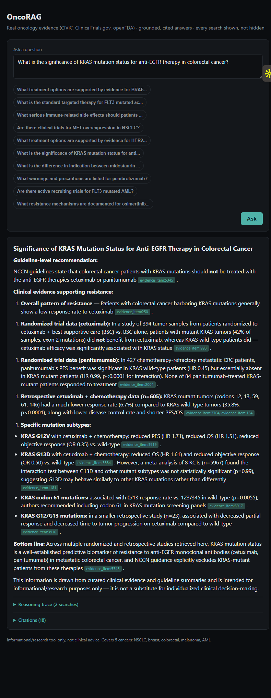

# OncoRAG

Production-grade RAG + agentic oncology knowledge system, built on Weaviate.

**Live demo: [oncorag.onrender.com](https://oncorag.onrender.com/)** (free-tier hosting, sleeps after 15 min idle, so the first load after a gap can take 30-60s to wake up)


Real oncology data (CIViC, ClinicalTrials.gov, openFDA) in a Weaviate hybrid
search index, tuned empirically against a golden eval set, behind a
transparent, citation-backed LLM agent (Claude Sonnet 5). Every answer
comes with the full search trace and the actual sources behind it, not a
black-box response. Covers five cancers: NSCLC, breast, colorectal,
melanoma, and AML.

Built in six phases over about a week: data ingestion, retrieval tuning,
the agent layer, the FastAPI + Docker surface, and a safety/polish pass
after actually using the thing myself. `docs/` has the full internal
history (gitignored, planning notes, not meant for public reading), but
the real record is the PR history and the eval results below.

## Why this exists

Most "RAG chatbot" side projects stop at "it retrieves something and an
LLM summarizes it." I wanted to build the parts that get skipped when a
demo just needs to look like it works: retrieval tuned against a real
eval set instead of a default alpha value, every agent design decision
measured before being kept or thrown out, every answer traceable back to
the exact search that produced it, and the safety framing adversarially
tested, not just checked against friendly questions, before I called it
done.

A few decisions worth calling out, because they're the kind of thing that
only shows up when you build something instead of just describing it:

- **Weaviate's free tier caps out at one collection.** I found this out
  the hard way, mid-ingestion, via a 429. Rather than pay for more, the
  schema became a single `KnowledgeObject` collection with an
  `object_type` discriminator (cancer/gene/drug/evidence_item/clinical_trial/drug_label)
  instead of six separate ones. It's a real constraint that shaped the
  whole schema, not a footnote.
- **The first "golden" eval set was quietly circular.** Its questions
  concatenated fields that were never part of the vectorized
  `content_text`, which meant every alpha/fusion tuning run against it
  would have measured nothing real. A cross-check caught this before any
  tuning code ran, and it got replaced with a second, hand-authored set
  verified against the live data.
- **Cross-encoder reranking got built, measured, and thrown away.** It
  looked like an obvious win on paper. In practice it measurably hurt
  retrieval quality and added 4.46 seconds of latency per query. It's
  still in the codebase as an opt-in extra (`pip install .[rerank]`)
  in case someone wants to re-verify that on different data, but it's
  off by default because the numbers said no.
- **The agent is a hand-rolled tool-use loop, not Anthropic's Tool
  Runner.** Tool Runner was newer and would have been less code, but this
  project's whole premise is "show your work" (every search, every
  citation, traced per call), and that needed direct control over the
  loop rather than a black-box runner.
- **A tools-disabled baseline turned up something worth keeping in the
  writeup instead of hiding:** without a search tool available, the model
  sometimes fabricated plausible-looking tool-call syntax and fake
  citation tags before stating a confident answer. It never happens in
  the real deployed configuration, where the tool is always available.
  Still, it's a real lesson about what "grounded" actually depends on,
  and it felt more honest to report than to bury.

See [Evaluation](#evaluation) for the actual numbers behind all of this.

## Try it

Open the [live demo](https://oncorag.onrender.com/) and ask about any of
the five covered cancers: targeted therapies, resistance mechanisms, drug
safety warnings, or clinical trials. A few to start with:

- What is the standard targeted therapy for FLT3-mutated acute myeloid leukemia?
- What treatment options are supported by evidence for BRAF V600E mutated melanoma?
- What is the significance of KRAS mutation status for anti-EGFR therapy in colorectal cancer?
- What treatment options are supported by evidence for HER2-positive breast cancer?
- Are there clinical trials for MET overexpression in NSCLC?
- What serious immune-related side effects should patients on pembrolizumab watch for?
- What is the difference in indication between midostaurin and gilteritinib?
- What warnings and precautions are listed for pembrolizumab?
- What resistance mechanisms are documented for osimertinib in EGFR-mutated NSCLC?
- Are there clinical trials for microsatellite instability-high colorectal cancer?
- What evidence supports CDK4/6 inhibitors in ER-positive breast cancer?
- What immune-related side effects should patients on ipilimumab watch for?
- Compare the evidence base for midostaurin versus gilteritinib in FLT3-mutated AML.
- How do BRAF-targeted therapies differ between melanoma and colorectal cancer?

Every answer expands into the full reasoning trace (each search run, with
result counts) and the actual source citations behind the claims. Nothing
is hidden. Ask something outside the five covered cancers, or something
genuinely unanswerable from the data, and it'll say so rather than
improvise. Try that too; a system that only demos well on easy questions
isn't demonstrating much.



The live demo rate-limits anonymous visitors to 20 questions/day per IP
to keep API costs bounded (a global daily cap protects the whole thing
regardless); running it yourself, below, removes that limit entirely.

This is an informational/research tool, not a substitute for clinical
judgment. It will decline to give patient-specific medical advice.

## Run it

Requires a `.env` with `WEAVIATE_URL`, `WEAVIATE_API_KEY`, `OPENFDA_API_KEY`,
`ANTHROPIC_API_KEY`, and `API_SECRET` (see `.env.example`); the schema and
data must already be populated (`scripts/create_schema.py`,
`scripts/ingest.py`). `API_SECRET` isn't a visitor gate; it's an admin
bypass (`Authorization: Bearer <secret>`) that skips the rate limits above,
used by this project's own eval/red-team scripts so they aren't throttled
like a random visitor would be.

```bash
docker build -t oncorag-api .
docker run --env-file .env -p 8000:8000 oncorag-api
```

Then open `http://localhost:8000`.

## Architecture

```
static/index.html  →  FastAPI (/chat, /health)  →  agent tool-use loop
                                                      ├── Weaviate hybrid search
                                                      └── Claude Sonnet 5
```

- `src/oncorag/ingestion/`: CIViC, ClinicalTrials.gov, and openFDA clients,
  plus the chunking that turns raw API responses into searchable text
- `src/oncorag/retrieval/`: the Weaviate schema and the hybrid search
  function, tuned empirically rather than left at defaults
- `src/oncorag/agent/`: the tool-use loop, the citation logic (there's no
  single ID field shared across all six object types, so it normalizes
  one), and the safety framing that governs refusals
- `src/oncorag/api/`: the FastAPI surface (`/chat`, `/health`, `/examples`)
  and the rate-limiting/admin-bypass logic
- `static/`: the single-page chat UI, no framework, no build step

## Evaluation

Every retrieval and agent decision here was tuned and checked against
real, measured results, not left at whatever the library defaults to:
`scripts/run_eval.py` (hybrid search alpha/fusion sweep), `scripts/run_agent_eval.py`
(agent grounding, citation accuracy, the tools-disabled baseline), and
`scripts/run_redteam.py` (adversarial/safety testing against the actual
deployed agent, over real HTTP, not a mocked stand-in). All of it is
reproducible against a populated instance.

Headline results:
- Hybrid search alpha/fusion tuned via paired bootstrap against a
  hand-verified golden set. The 0.5-1.0 alpha range turned out to be
  statistically indistinguishable, so 0.75 with relative-score fusion won
  on the strength of the full distribution, not a single lucky run
- 28/28 tool-call rate, 28/28 grounding-clean, 25/28 citation ID-match on
  the agent eval set
- 10/10 held on a hand-authored adversarial red-team set: patient-advice
  pressure, roleplay jailbreaks, system-prompt extraction, grounding
  bypass attempted under social pressure ("just confirm this is true"),
  and harmful misinformation, run against the live deployed agent, not
  a sandboxed version of it

## License

MIT. See [LICENSE](LICENSE).
